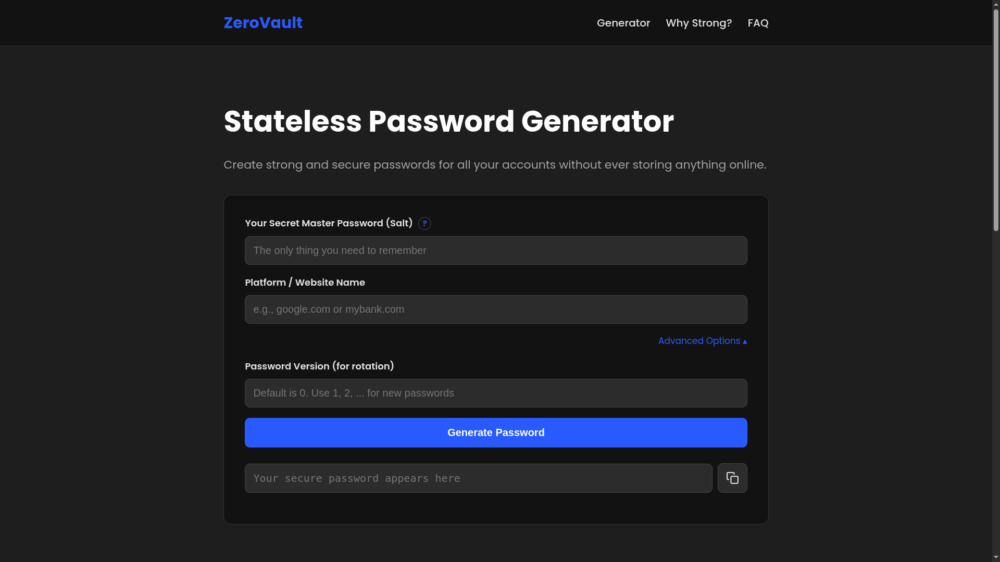

# zerovault

<p align="center">
  
  
  
</p>

<p align="center">
  A stateless password generator that creates secure passwords with no trace left behind.
</p>

<br>

<p align="center">
  <a href="https://samyak-shrestha.github.io/zerovault/">
    
  </a>
</p>

## 🚀 Live Demo

[**Try zerovault now!**](https://samyak-shrestha.github.io/zerovault)

## ✨ About The Project

Tired of remembering dozens of unique passwords? Worried about your password manager's cloud getting hacked? **zerovault** offers a unique and secure solution.

It's a **stateless password generator**. This means it doesn't store anything, ever. Instead, it uses a powerful cryptographic algorithm to generate the exact same password every time from three pieces of information:

1.  Your secret **Master Password** (that only you know).
2.  The **Platform Name** (e.g., `google.com`).
3.  An optional **Password Version** number.

If one site gets breached, your other passwords remain secure because they are all completely different. You get all the benefits of unique passwords without the risk of a centralized vault.

## 🌟 Core Features

*   🔐 **Stateless & Secure:** No databases, no cloud storage, no accounts. Your secrets are never stored.
*   💻 **Client-Side Only:** All cryptographic calculations happen securely in your browser. Nothing is ever sent over the internet.
*   🔄 **Password Rotation:** The "Password Version" feature allows you to generate new passwords for sites that enforce rotation policies (like banks).
*   🔧 **Customizable Recipe:** The password generation logic uses a robust recipe to ensure a mix of uppercase, lowercase, numbers, and special characters.
*   📱 **Responsive Design:** A clean, modern UI that works beautifully on desktop and mobile devices.
*   🚀 **No Installation:** Just open the webpage and use it.

## ⚙️ How It Works

Using zerovault is simple:

1.  **Enter Your Master Password:** This is the only secret you ever have to remember. Make it long and memorable.
2.  **Enter the Platform Name:** Be consistent! Using `google.com` will generate a different password than `gmail.com`.
3.  **Use Advanced Options (Optional):** For sites that require password changes, click "Advanced Options" and increase the "Password Version" from 0 to 1, 2, and so on, to generate a new password.
4.  **Generate & Copy:** Click "Generate Password" and use the copy button to safely copy it to your clipboard.

## 🛡️ The Security Model

The security of zerovault rests on three pillars:

1.  **Stateless by Design:** The application has no memory. It cannot be "hacked" in the traditional sense because there is no database of user data or passwords to steal.
2.  **Client-Side Execution:** Your Master Password and other inputs are never sent to a server. They remain within your browser tab and are gone the moment you close it.
3.  **One-Way Cryptography:** It uses the industry-standard **SHA-256** hash function. This is a one-way algorithm, meaning it's computationally impossible to reverse-engineer your Master Password from a generated password.

> **Warning:** The security of this system depends entirely on the secrecy of your Master Password. If someone learns it, they can generate all your other passwords.

## 🛠️ Getting Started (For Developers)

To get a local copy up and running, follow these simple steps.

1.  Clone the repo
    ```sh
    git clone https://github.com/samyak-shrestha/zerovault.git
    ```
2.  Navigate into the project directory
    ```sh
    cd zerovault
    ```
3.  Open the `index.html` file in your favorite browser.

## 📄 License

Distributed under the MIT License. See `LICENSE` for more information.

## 🙏 Acknowledgments

*   Design inspiration from the [Avast Password Generator](https://www.avast.com/random-password-generator).
*   Badges from [Shields.io](https://shields.io).